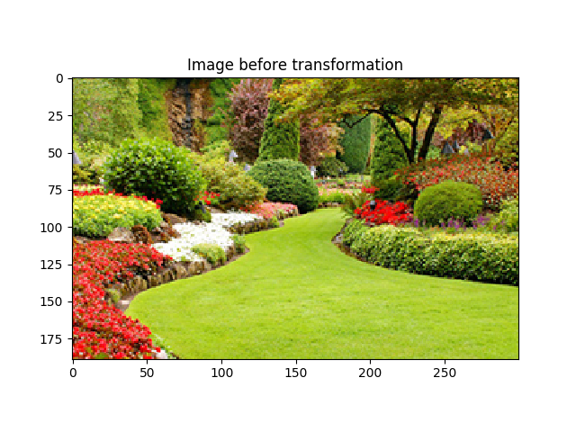
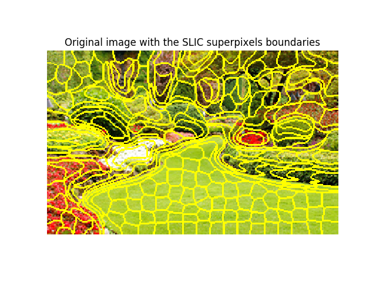
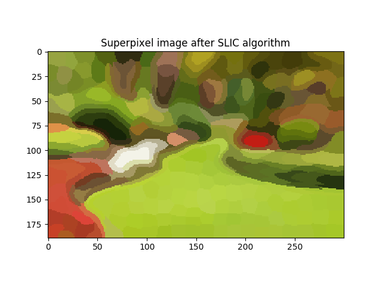
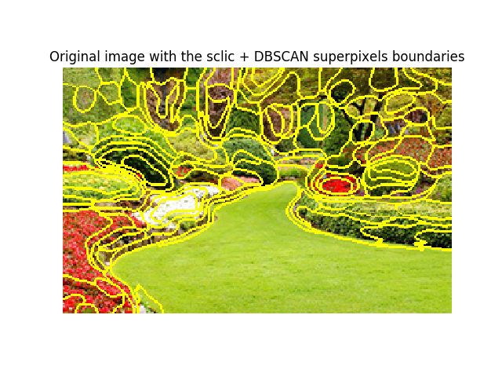
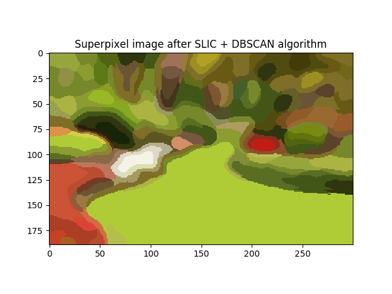

# SLIC_DBSCAN_Superpixels
This script segment an image into superpixels using the sclic algorithm combined with DBSCAN in Matlab and Python.

## Matlab version

## Python version

This repository requires:
* matplotlib `pip install matplotlib`
* skimage `pip install skimage`
* numpy `pip install numpy`
* sklearn `pip install sklearn`

To divide an image into superpixels using the SLIC algorithm and fuse them using the DBSCAN algorithm, run the following command:

`python test.py --image=/path/to/image`

The obtained results are below:

